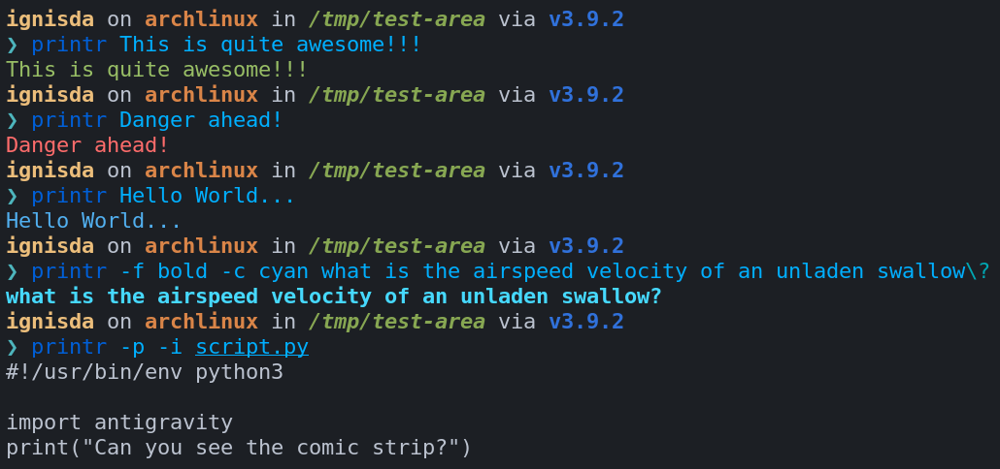

# printr

`printr` is the smarter `echo` alternative. It is meant as a drop-in replacement of `echo`
and has additional features like automatically guessing the sentiment of the string passed
to it and then outputting it in the corresponding color.

For example:

1. A positive statement will be colored green.

   ```bash
   printr This is quite awesome!
   ```

2. A negative statement will be colored red.

   ```bash
   printr Danger ahead!
   ```

3. A neutral statement will be colored blue.

   ```bash
   printr Hello World...
   ```

For a full list of options and flags available, run `printr --help`.

Behind the scenes, `printr` performs some light sentiment analysis to guess whether a
statement is positive, negative or neutral.

## Screenshot of printr in action



## Summary

- [printr](#printr)
  - [Screenshot of printr in action](#screenshot-of-printr-in-action)
  - [Summary](#summary)
    - [Installing](#installing)
  - [Contributing](#contributing)
  - [Versioning](#versioning)
  - [Authors](#authors)
  - [License](#license)
  - [Others](#others)

### Installing

`printr` comes packaged with a convenience install script that can run on all bash systems.
Run the following command in your terminal (git-bash for windows users).

```bash
curl https://raw.githubusercontent.com/IgnisDa/printr/main/get-printr.bash -o get-printr.bash
# Warning: always examine scripts downloaded from the internet before running them locally.
bash get-printr.bash
```

The above command can also be used to update your current installation of `printr`.

## Contributing

Please read [CONTRIBUTING.md](CONTRIBUTING.md) for details on our code
of conduct, and the process for submitting pull requests to us.

## Versioning

We use [SemVer](http://semver.org/) for versioning. For the versions
available, see the [tags on this
repository](https://github.com/IgnisDa/printr/tags).

## Authors

See also the list of [contributors](contributors.md) who participated in this project.

## License

This project is licensed under the
[Apache-2.0](https://www.apache.org/licenses/LICENSE-2.0) - see the
[LICENSE.md](LICENSE.md) file for details

## Others

Project bootstrapped using [cookiecutter](https://github.com/IgnisDa/project-cookiecutter)
by IgnisDa.
